# 🏡 HabiSpace

HabiSpace is a modern real estate Flutter application built using Clean Architecture and BLoC/Cubit state management. The platform enables users to discover, search, and explore properties, manage their favorite listings, view property locations on Google Maps, make secure payments, and maintain their profiles through a seamless and intuitive user experience.

The application is designed with scalability, maintainability, and performance in mind, leveraging a feature-based architecture, dependency injection, and RESTful API integration to deliver a robust and production-ready solution.

Whether users are searching for their next home, browsing premium properties, or managing their real estate activities, HabiSpace provides a complete and user-friendly experience across mobile devices.

## ✨ Features

### 🔐 Authentication & Security

* Login
* Register
* Google Sign-In
* Forgot Password
* Change Password
* Secure Token Management

### 👤 User Management

* User Profile Management
* Update Personal Information
* Profile Settings

### 🏠 Property Features

* Property Listings
* Best Selling Properties
* Categories & Property Types
* Property Details
* Property Search
* Favorites Management
* Recently Viewed History

### 💳 Payments

* Payment Integration
* Secure Payment Processing

### 📍 Location Services

* Google Maps Integration
* Property Location Display
* Interactive Map Navigation

### 🎨 User Experience

* Multi-language Support (English & Arabic)
* Dark & Light Theme
* Responsive UI Design

### ⚙️ Architecture & Development

* Clean Architecture
* Dependency Injection
* Repository Pattern
* REST API Integration using Dio
* State Management using Bloc & Cubit
* Scalable Feature-Based Structure


---

## 📱 Screenshots

### Splash Screen

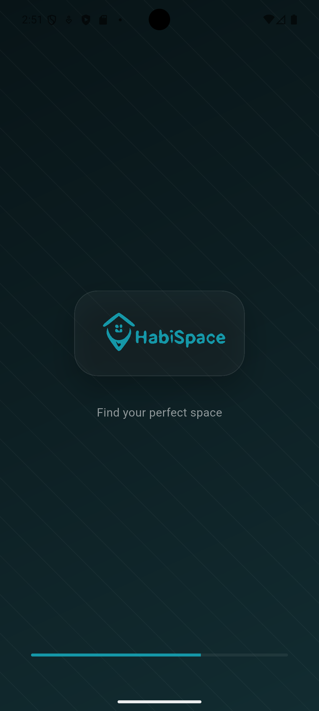

### Boarding1 Screen

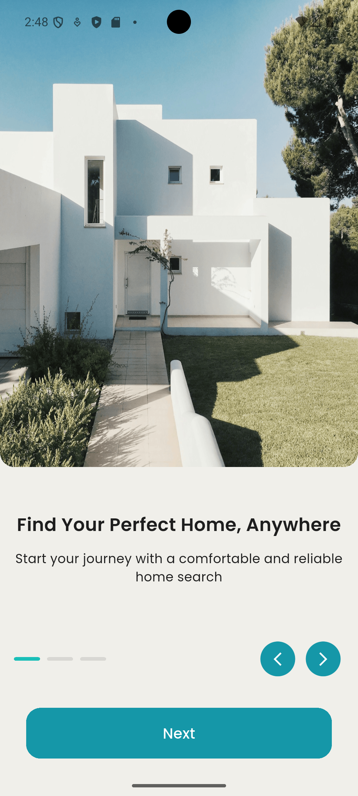

### Boarding2 Screen

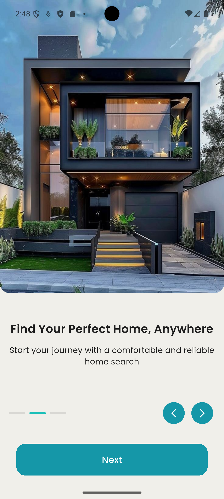

### Boarding3 Screen

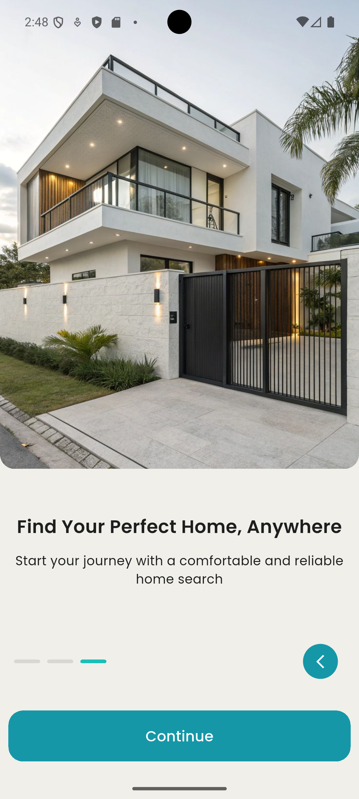

### Login Screen

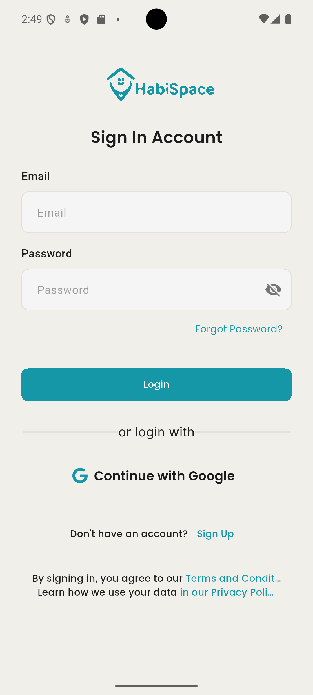

### Register Screen

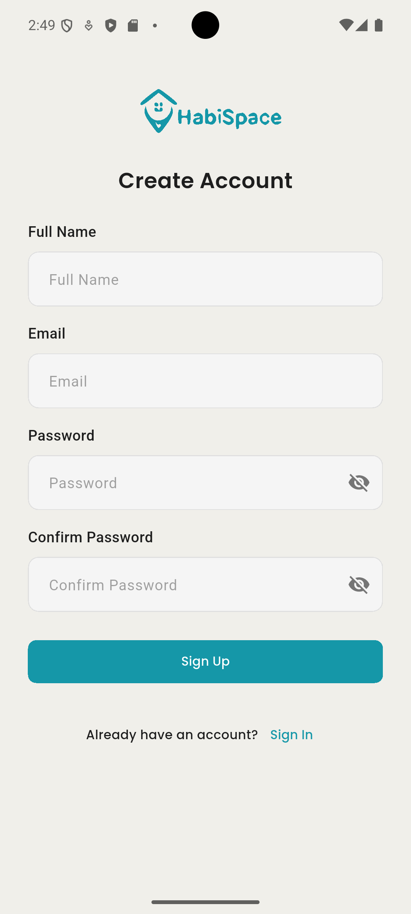

### Home Screen

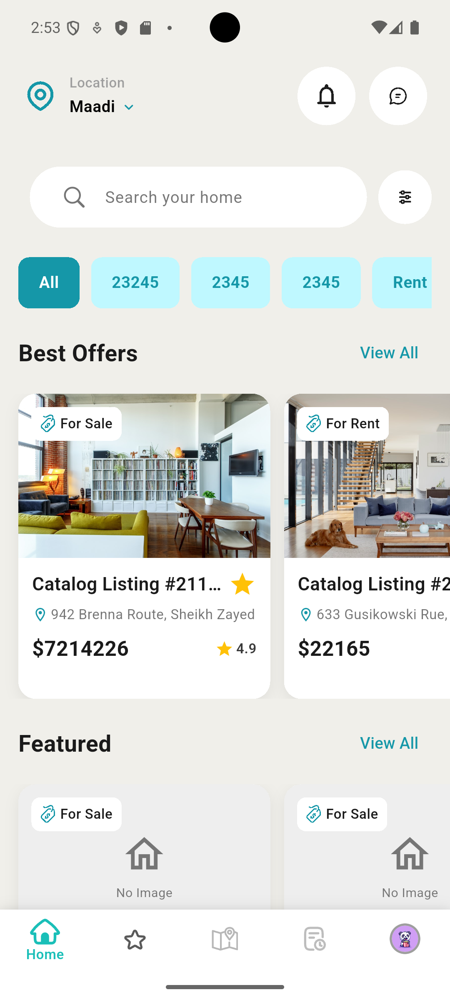

### Details Screen

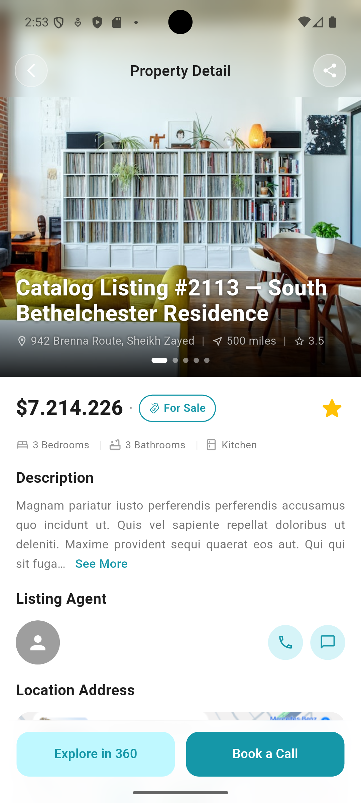

### Filter Screen

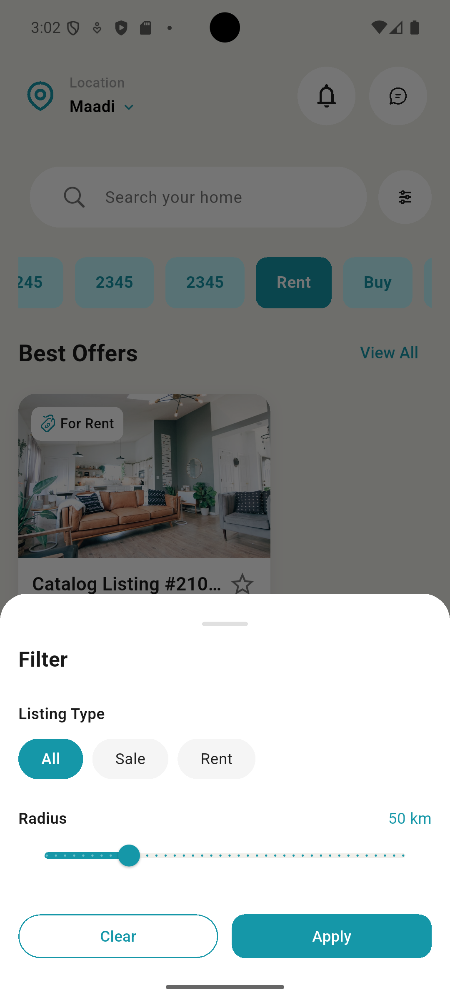

### Booking Screen

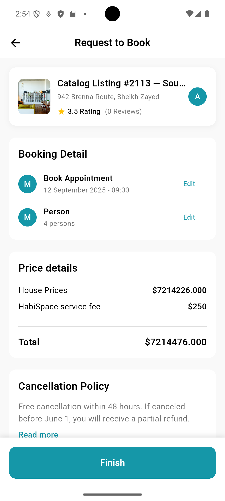

### 3D Screen

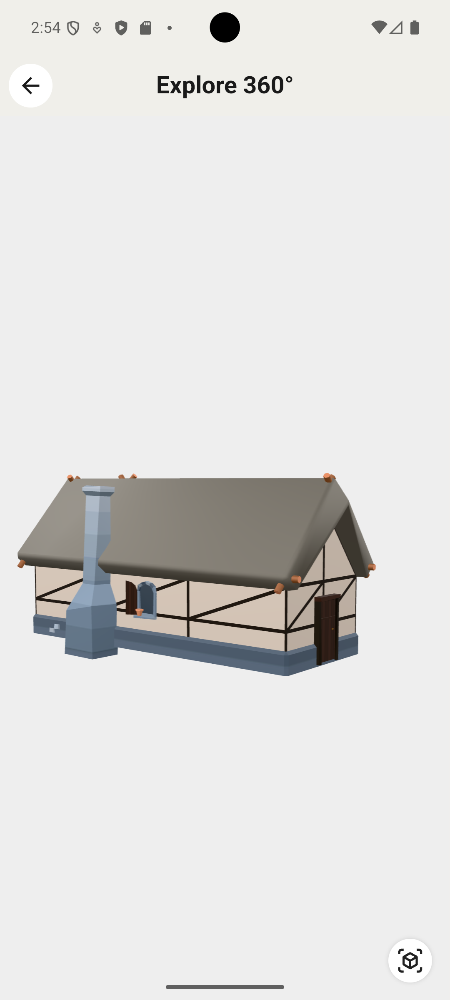

### Chat Screen

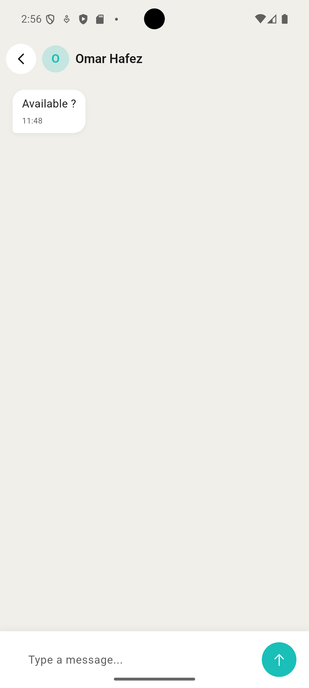

### Favorite Screen

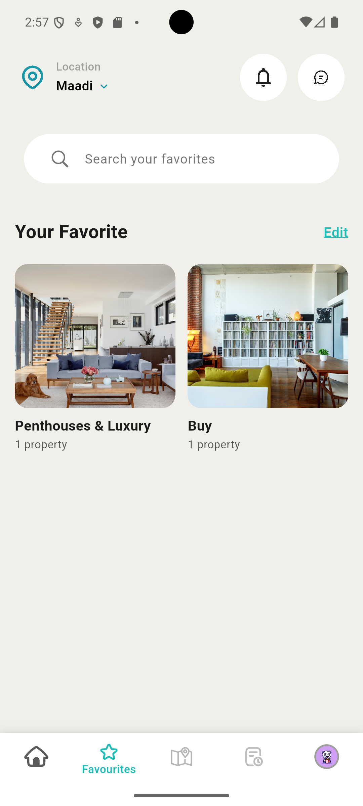

### Map Screen

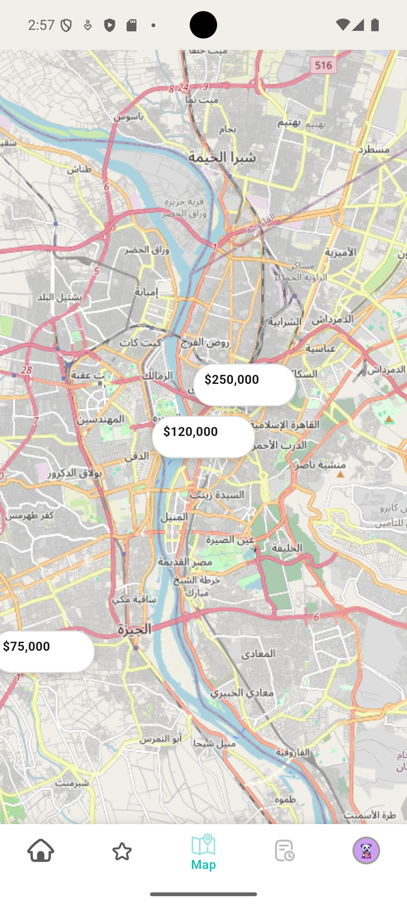

### History Screen

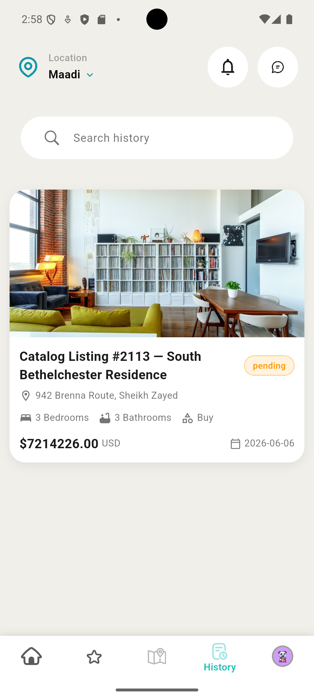

### Profile Screen

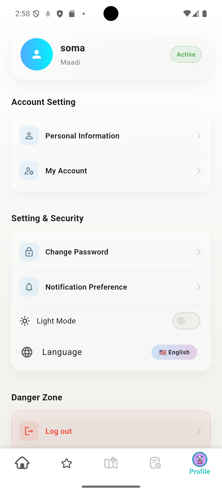

---

## 🏗 Architecture

This project follows Clean Architecture principles:

```
lib/
├── core/
│   ├── constants/
│   ├── error/
│   ├── network/
│   ├── router/
│   ├── services/
│   ├── theme/
│   └── utils/
│
├── features/
│   ├── auth/
│   │   ├── data/
│   │   ├── domain/
│   │   └── presentation/
│   │
│   ├── home/
│   │   ├── data/
│   │   ├── domain/
│   │   └── presentation/
│   │
│   ├── profile/
│   │   ├── data/
│   │   ├── domain/
│   │   └── presentation/
│   │
│   └── other features/
│       ├── data/
│       ├── domain/
│       └── presentation/
│
└── main.dart
```

### Flutter Packages

* flutter_bloc
* dio
* go_router
* easy_localization
* get_it
* flutter_screenutil
* flutter_secure_storage
* shimmer

### Architecture

* Clean Architecture
* Repository Pattern
* Dependency Injection
* Cubit State Management

---

## 🚀 Getting Started

### Prerequisites

* Flutter SDK 3.10+
* Dart SDK
* Android Studio / VS Code

### Installation

1. Clone the repository

```bash
git clone https://github.com/Mahmouuddiab/hapiSpace.git
```

2. Navigate to the project

```bash
cd hapiSpace
```

3. Install dependencies

```bash
flutter pub get
```

4. Run the application

```bash
flutter run
```

---

## 📂 API Integration

The application consumes REST APIs using Dio and follows a layered architecture:

* Remote Data Source
* Repository Layer
* Use Cases
* Cubit State Management
* Presentation Layer

---

## 🌍 Localization

Supported languages:

* English 🇺🇸
* Arabic 🇸🇦

Localization is implemented using:

```yaml
easy_localization
```

## 🤝 Contributing

Contributions are welcome.

1. Fork the repository
2. Create your feature branch

```bash
git checkout -b feature/new-feature
```

3. Commit your changes

```bash
git commit -m "Add new feature"
```

4. Push to the branch

```bash
git push origin feature/new-feature
```

5. Open a Pull Request
---


## 👨‍💻 Author

Mahmoud Sayed Diab

GitHub:
https://github.com/Mahmouuddiab

---
